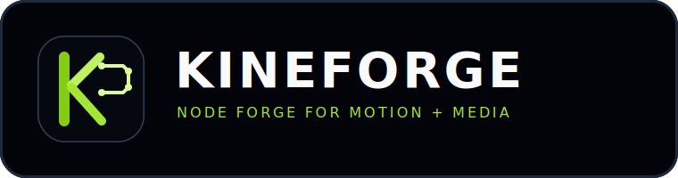

# Kineforge



`Kineforge is a node-based live media forge where body motion, AI vision, and GPU visuals are composed in real time.`

Kineforge is built for dancers and media artists who want to prototype interaction pipelines quickly in the browser.

## Brand Assets

- Logo lockup: `public/brand/kineforge-logo.svg`
- Symbol mark: `public/brand/kineforge-mark.svg`
- Canonical slug: `kineforge`
- Main repository: `https://github.com/0dot77/kineforge`

## Tech Stack

- Next.js (App Router)
- TypeScript
- Tailwind CSS v4
- React Flow (`@xyflow/react`)
- MediaPipe Tasks Vision (Face + Hand)

## What You Can Do

- Capture live performer input from webcam
- Extract face landmarks and expression cues
- Extract hand landmarks and pinch/lift gestures
- Compose overlay and mapping stages
- Monitor reactive stage output in PiP
- Toggle debug preview per node
- Double-click empty canvas to open node picker and spawn nodes

## Development

```bash
git clone https://github.com/0dot77/kineforge.git
cd kineforge
npm install
npm run dev
```

Open: `http://localhost:4173`

## Production Build

```bash
npm run build
npm run start
```

## Notes

- Camera permission is required.
- Models are loaded from official MediaPipe model storage.
- If graph layout gets messy, click `Reset Graph`.
